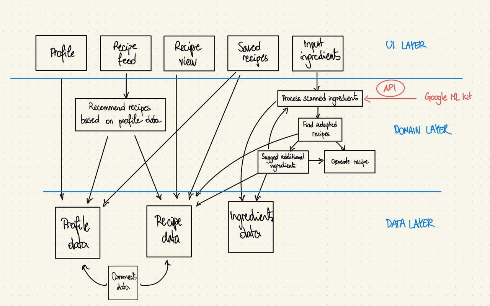
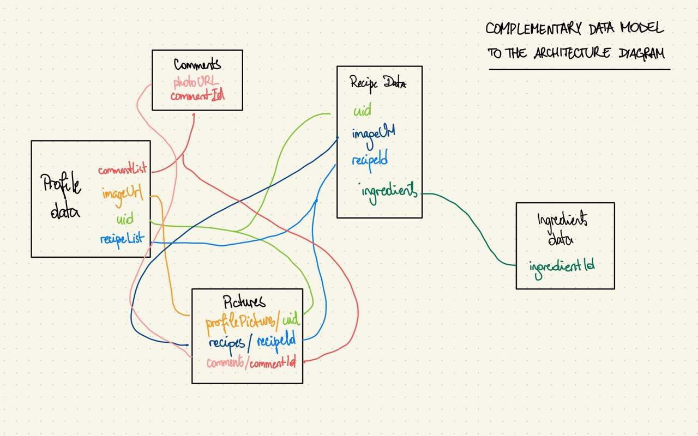

# FeedMe
A repository for our group project for the CS-311 class "The Software Enterprise" at EPFL.

# Architecture diagram
Below you will find our proposed architecture diagram and a data model diagram for the application :

# About
FeedMe is a comprehensive app aiming at nurturing healthy eating habits among its users. It provides an extensive database of recipes to choose from with an accent on healthy ones. The app promotes those recipes using a personalized feed with recommendations based on ratings, as well as recommending recipes based on the user's ingredients to help them to choose his next meal and encourage them to cook with what he has at home.

# Features
- **Personalized feed**: The app provides a personalized feed with recommendations based on ratings.
- **Search**: The user can search for recipes based on ingredients, diet, cuisine, and meal type.
- **Recipe details**: The user can view the details of a recipe, including the ingredients, the preparation steps, and the nutritional information.
- **Recipe recommendation**: The app recommends recipes based on the user's ingredients, inputted through barcode scanning, text recognition, or image recognition.